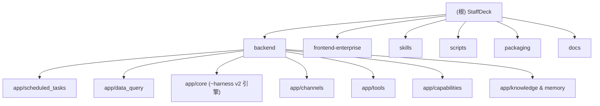

# StaffDeck — 仓库级 AI 上下文（根）

> 当前分支：`feat/clean-data-query-and-interval`（聚焦 data_query 中心与 interval 调度）。
> 本文件由“初始化架构师”生成/增量更新，配套 `.claude/index.json`。

## 项目愿景

StaffDeck 由 OpenBMB / 清华-THUNLP / 东北大学-面壁联合实验室 / AI9Stars 联合研发，是一套**面向企业的数字员工（Digital Employee）构建与管理平台**，AGPL-3.0 开源。目标是把专业员工的经验、业务流程与判断标准固化为可持续工作的数字员工：支持状态机驱动的 SOP 流程技能、文档结构感知的知识检索、HTTP/MCP/定时任务自主执行，以及长期记忆、Trace、真人接管与反馈驱动的迭代闭环。

## 架构总览

单进程 FastAPI 应用（`5173` 端口同时提供 UI / API / Swagger），SQLModel+SQLite（`skill_agent_loop.db`）持久化，OpenAI Chat Completions 兼容模型服务为推理后端。

核心运行时链路（Harness v2）：用户消息 → Router 意图分发 → 能力发现/权限 → TaskFrame 规划与执行 → 技能/知识/工具/沙箱执行 → 事件流回放与 Turn 终决。IM 渠道（微信/企微/飞书/钉钉）通过渠道无关的适配器注册表接入，支持多员工调度、意图自动分发、身份合并与对话观测。

## ✨ 模块结构图（Mermaid）

## 模块索引

| 模块 | 路径 | 语言/栈 | 一句话职责 |
|---|---|---|---|
| backend | `backend/` | Python / FastAPI / SQLModel / SQLite | 接口、Agent 运行时、存储、渠道与任务 Worker |
| — scheduled_tasks | `backend/app/scheduled_tasks/` | Python | 定时/周期任务：草稿、调度、租约、Harness v2 成功判定 |
| — data_query | `backend/app/data_query/` | Python | 数据查询中心：数据源、查询模板、MySQL/HTTP 连接器、AES-GCM 加密 |
| frontend-enterprise | `frontend-enterprise/` | TS / React 18 / Vite 8 / Tailwind 4 / Vitest | StaffDeck 企业工作台（chat / dashboard / data-query / scheduled-tasks）|
| skills | `skills/` | SKILL.md 定义 | 面向 Agent 的技能包：staffdeck-API 系列 + 固定流程模板 |
| scripts | `scripts/` | Python / PS / bash | 单端口服务生命周期（dev_up/down/status）入口 `dev.py` |
| packaging | `packaging/` | Python / PS / sh | macOS / Linux / Windows 桌面打包与签名 |
| docs | `docs/` | Markdown | 开放 API v1、教程与 Agent 协作约定（`.gitignore` 中，本地目录）|

## 运行与开发

- 环境：Python 3.11+、Node 20+；OpenAI 兼容模型接口。
- 初始化：`backend/.venv` + `pip install -e "backend[dev]"`；`npm --prefix frontend-enterprise ci`；复制 `backend/.env.example` → `backend/.env`（须配置 `DEMO_MODEL_*` 与强随机 `APP_SECRET`）。
- 启动：`scripts/dev_up.sh --detach`（Windows：`.\scripts\dev_up.ps1 --detach`），统一入口 `python scripts/dev.py up --detach`；停止/状态 `dev_down` / `dev_status`。
- 验证：`curl http://127.0.0.1:5173/api/health` → `{"status":"ok"}`；UI 从 `/workspace/gallery` 进入。
- 默认管理员 `admin` / `admin`。

## 测试策略

- backend：`pytest`，测试目录 `backend/tests/`（约 157+ 个 `test_*.py`；含 Windows 已知本机失败基线，见 `backend/AGENTS.md`）。
- frontend：`vitest run`，同址 `*.test.ts(x)`（Testing Library + jsdom）。
- lint：backend `ruff`（line-length 100）；frontend `tsc -b`/`vite build`、`i18n:check`、`config:check`。

## 编码规范

- 后端：FastAPI + SQLModel；路由收口在 `app/api/`，逻辑在对应 `app/<domain>/service.py`；SQL 表模型集中在 `app/db/models.py`；禁止硬编码本机路径，环境变量经 `app/config.py`。
- 前端：React 函数组件 + shadcn/Radix UI；路由常量 `src/enums/routes.ts`；同源 API 走 `src/api/client.ts`；文案进 i18n。
- 安全：敏感配置（渠道凭证、数据库口令等）AES-256-GCM 加密落库（`enc:` 前缀）；任何接口不回传明文。

## AI 使用指引

- 阅读各级模块 `CLAUDE.md`（面包屑可回根）后再动手；`.claude/index.json` 记录覆盖缺口与下一步。
- 涉及 `scheduled_tasks` / `data_query` 的改动是当前分支热点，先读对应模块 docs 与记忆沉淀（销售播报、定时任务假成功等经验）。
- 大目录（`node_modules/`、`backend/.venv/`、`packaging/sandbox_runtime/`、日志与 `*.db*`）默认忽略。

## 变更记录 (Changelog)

- 2026-09-23T18:06 — 初始化架构师（增量）：重建根级 CLAUDE.md；新增 Mermaid 结构图；新增 `data_query` 模块文档与导航面包屑；更新 `.claude/index.json`。