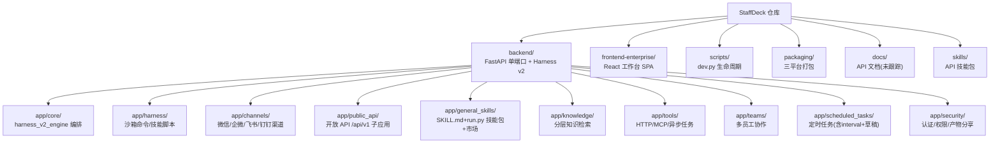

# StaffDeck

> 面向企业的数字员工构建与管理平台（OpenBMB，AGPL-3.0）。
> 将专业员工的经验、流程与判断标准固化为拥有岗位/工号/能力档案的数字员工，接手重复性任务，沉淀为可复用、可迭代、可追溯的组织资产。

- 最近更新：2026-09-17T10:09:30+08:00（增量扫描，索引见 `.claude/index.json`）
- 初始化时间：2026-09-11T15:42:50（由 `/zcf:init-project` 生成）
- 仓库规范见 [AGENTS.md](AGENTS.md)（构建/测试命令、代码风格、提交规范）——本文件不重复其内容，冲突时以 AGENTS.md 为准。

## 架构总览

单端口架构：一个 FastAPI 进程（端口 5173）同时提供 UI、API 与 Swagger；桌面版与 Web 共用同一运行时。

- **backend**：Python 3.11+ / FastAPI / SQLModel / SQLite。Harness v2 执行内核（沙箱工具调用）、24 个子包、67 个数据模型、157 个测试。
- **frontend-enterprise**：React 18 + TypeScript + Vite 8 + Tailwind 4 + Radix(shadcn)。企业工作台 SPA，73 个页面/组件，52 个测试文件，挂在 `/enterprise`。
- **scripts**：跨平台生命周期（`dev.py` supervisor 统一拉起 app/backend/enterprise/chat）。
- **packaging**：macOS/Linux/Windows 三平台打包（PyInstaller + Inno Setup + 签名）。
- **docs**：开放 API 与教程（**注意：`/docs/` 在 .gitignore 中，属本地未跟踪目录**）。
- **skills**：4 个仓库级 `staffdeck-api-*` 技能包。



## 模块索引

| 模块 | 路径 | 职责 | 文档 |
|---|---|---|---|
| backend | `backend/` | 单端口 FastAPI、Harness v2 执行内核、24 子包、67 数据模型、157 测试 | [backend/CLAUDE.md](backend/CLAUDE.md) |
| frontend-enterprise | `frontend-enterprise/` | 企业工作台 SPA（73 页面/组件，52 测试文件） | [frontend-enterprise/CLAUDE.md](frontend-enterprise/CLAUDE.md) |
| scripts | `scripts/` | 跨平台生命周期（supervisor 模型，.dev/ 运行目录） | [scripts/CLAUDE.md](scripts/CLAUDE.md) |
| packaging | `packaging/` | PyInstaller/Inno Setup/签名（忽略 sandbox_runtime 生成物） | [packaging/CLAUDE.md](packaging/CLAUDE.md) |
| docs | `docs/` | 开放 API v1 等文档（gitignore 未跟踪） | [docs/CLAUDE.md](docs/CLAUDE.md) |
| skills | `skills/` | staffdeck-api-{auth,manage-resources,manage-sops,run-agent} | [skills/CLAUDE.md](skills/CLAUDE.md) |

## 运行与开发（速查）

```powershell
# Windows PowerShell（macOS/Linux/WSL 用 scripts/dev_up.sh）
py -3 -m venv backend\.venv
.\backend\.venv\Scripts\python.exe -m pip install -e "backend[dev]"
npm --prefix frontend-enterprise ci
Copy-Item backend/.env.example backend/.env   # 首次配置 APP_SECRET 与模型 API Key
.\scripts\dev_up.ps1 --detach                 # 后台启动；状态 dev_status.ps1；停止 dev_down.ps1
# 验证
curl.exe http://127.0.0.1:5173/api/health
```

测试与质量（详见 AGENTS.md）：`backend/.venv/bin/python -m pytest backend/tests`、`ruff check backend`、`npm --prefix frontend-enterprise test`、`i18n:check`、`config:check`。

## 全局规范要点

- 后端 Python 3.11+，类型注解、snake_case、Ruff 100 列；前端 TS strict、两空格单引号分号、`@/` 别名。
- 提交遵循 Conventional Commit（如 `feat(channels): add binding status`）。
- 生产迁移路径**仅支持 SQLite**（`create_all` 建表、无 ALTER）。
- Harness 命令一律经 OS 进程沙箱执行，**无未沙箱回退**。
- 不提交密钥/渠道凭证；`backend/.env`、`*.db` 均不入库。

## AI 使用指引

- 改动权限、持久化、流式、渠道路由相关行为时必须补回归测试；UI 改动需在浏览器按路由+角色校验。
- 生成物不要扫描：`.venv`、`node_modules`、`dist`、`sandbox_runtime`、`__pycache__`、`.dev/`、`*.db*`。
- 优先阅读模块级 CLAUDE.md 再进入代码；深入沙箱/知识检索/异步任务等区域前先看 `.claude/index.json` 的 next_steps。
- 通用技能市场相关改动需同时检查 `backend/app/api/general_skills.py` 的市场端点与 `frontend-enterprise/src/pages/general-skills/SkillMarketDialog.tsx`。
- 产物分享链接改动需关注 `app/security/artifact_share.py` 的 HMAC 签名与路径归一化安全逻辑。

## Changelog

- 2026-09-17T10:09:30+08:00 增量更新：新增技能市场（general_skills market API + SkillMarketDialog）、Harness 产物签名分享（artifact_share.py）、定时任务 interval 调度与草稿系统、渠道团队绑定；测试数 152→157；前端测试 40+→52；更新 Mermaid 结构图与模块索引。
- 2026-09-11T15:42:50 初始化：6 模块文档 + Mermaid 结构图 + 导航面包屑 + 覆盖率索引。
