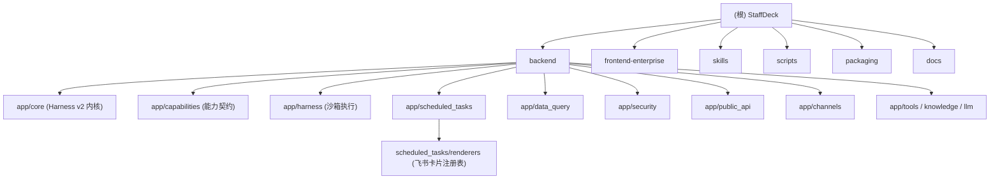

# StaffDeck — 仓库级 AI 上下文（根）

> 当前分支：`feat/clean-data-query-and-interval`（聚焦 data_query 中心与 interval 调度）。
> 本文件由“初始化架构师”生成/增量更新，配套 `.claude/index.json`。
> 另有一份英文 `AGENTS.md`（含 Windows 测试基线、提交规范）与 `README.md` / `README.zh.md`。

## 项目愿景

StaffDeck 由 OpenBMB / 清华-THUNLP / 东北大学-面壁联合实验室 / AI9Stars 联合研发，是一套**面向企业的数字员工（Digital Employee）构建与管理平台**，AGPL-3.0 开源。目标是把专业员工的经验、业务流程与判断标准固化为可持续工作的数字员工：支持状态机驱动的 SOP 流程技能、文档结构感知的知识检索、HTTP/MCP/定时任务自主执行，以及长期记忆、Trace、真人接管与反馈驱动的迭代闭环。

## 架构总览

单进程 FastAPI 应用（`5173` 端口同时提供 UI / API / Swagger），SQLModel+SQLite（`skill_agent_loop.db`）持久化，OpenAI Chat Completions 兼容模型服务为推理后端。

核心运行时链路（Harness v2）：用户消息 → Router 意图分发 → 能力发现/权限 → TaskFrame 规划与执行 → 技能/知识/工具/沙箱执行 → 事件流回放与 Turn 终决。IM 渠道（微信/企微/飞书/钉钉）通过渠道无关的适配器注册表接入，支持多员工调度、意图自动分发、身份合并与对话观测。

## ✨ 模块结构图（Mermaid）

## 模块索引

| 模块 | 路径 | 语言/栈 | 一句话职责 | 文档 |
|---|---|---|---|---|
| backend | `backend/` | Python / FastAPI / SQLModel / SQLite | 接口、Agent 运行时、存储、渠道与任务 Worker | [backend/CLAUDE.md](backend/CLAUDE.md) |
| — core | `backend/app/core/` | Python | Harness v2 内核：Turn 规划、TaskFrame、能力清单/渐进披露、能力调用、上下文投影、恢复 | [core](backend/app/core/CLAUDE.md) |
| — capabilities | `backend/app/capabilities/` | Python | 能力契约端口/适配器、注册表与不可变快照、本地知识/技能包实现 | [capabilities](backend/app/capabilities/CLAUDE.md) |
| — scheduled_tasks | `backend/app/scheduled_tasks/` | Python | 定时/周期任务：草稿、调度、租约、Harness v2 成功判定、pipeline 通道 | [scheduled_tasks](backend/app/scheduled_tasks/CLAUDE.md) |
| — renderers | `backend/app/scheduled_tasks/renderers/` | Python | 飞书卡片渲染器注册表（销售卡 2.0 / 通用表）与数值格式化工具 | [renderers](backend/app/scheduled_tasks/CLAUDE.md) |
| — data_query | `backend/app/data_query/` | Python | 数据查询中心：数据源、查询模板、MySQL/HTTP 连接器、AES-GCM 加密 | [data_query](backend/app/data_query/CLAUDE.md) |
| frontend-enterprise | `frontend-enterprise/` | TS / React 18 / Vite 8 / Tailwind 4 / Vitest | StaffDeck 企业工作台（chat / dashboard / data-query / scheduled-tasks）| [frontend-enterprise/CLAUDE.md](frontend-enterprise/CLAUDE.md) |
| skills | `skills/` | SKILL.md 定义 | 面向 Agent 的技能包：staffdeck-API 系列 + 固定流程模板 | [skills/CLAUDE.md](skills/CLAUDE.md) |
| scripts | `scripts/` | Python / PS / bash | 单端口服务生命周期（dev_up/down/status）入口 `dev.py` | [scripts/CLAUDE.md](scripts/CLAUDE.md) |
| packaging | `packaging/` | Python / PS / sh | macOS / Linux / Windows 桌面打包与签名 | [packaging/CLAUDE.md](packaging/CLAUDE.md) |
| docs | `docs/` | Markdown | 开放 API v1、教程与 Agent 协作约定（`.gitignore` 中，本地目录）| [docs/CLAUDE.md](docs/CLAUDE.md) |

## 任务 → 文件对照（跨模块速查）

| 我要改的功能 | 首选文件 |
|---|---|
| Agent 如何规划/执行一轮对话 | `backend/app/core/harness_v2_engine.py` → `turn_planner.py` → `task_frame_store.py` |
| 模型能看到/调用哪些能力 | `backend/app/core/capability_manifest.py`（授权）+ `capability_discovery.py`（8K 投影） |
| 某个内建能力（含 `data_query_search`/`data_query_execute`）行为 | `backend/app/core/harness_capability_invoker.py` `_invoke_internal` |
| 沙箱/命令/脚本执行语义 | `backend/app/harness/`（`sandbox.py`、`command.py`、`skill_script.py`、`executor.py`） |
| 定时任务调度/成功判定/假成功 | `backend/app/scheduled_tasks/service.py`、`worker.py` |
| 定时任务 pipeline 步骤与飞书卡片渲染 | `backend/app/scheduled_tasks/pipeline.py`、`scheduled_tasks/renderers/`（`__init__.py` 注册表 / `sales_card.py` / `generic_table.py`） |
| 数据查询模板/连接器/SQL 白名单 | `backend/app/data_query/service.py`、`executor.py`、`connectors/mysql_connector.py` |
| 权限/租户/加密/内部令牌 | `backend/app/security/permissions.py`、`tenant.py`、`encryption.py`、`internal_service.py` |
| 开放 API v1 端点与鉴权 | `backend/app/public_api/`（`app.py`、`auth.py`、`credential_profiles.py`、各资源路由） |
| IM 渠道接入 | `backend/app/channels/`（`adapters/base.py` + 各平台适配器） |
| 知识检索 | `backend/app/knowledge/`（`service.py`、`okf.py`、`parser.py`） |
| 数据表/迁移 | `backend/app/db/models.py`（唯一表模型来源）、`db/seed.py`（演示数据） |
| 前端页面/路由 | `frontend-enterprise/src/enums/routes.ts` + `src/App.tsx` + `src/pages/<域>/` |
| 前端 API 调用 | `frontend-enterprise/src/api/client.ts`、`src/api/data-query.ts` |
| 前端文案 | `frontend-enterprise/src/i18n/en.json`（+ `npm run i18n:check`） |
| 服务启停/生命周期 | `scripts/dev.py`（统一入口）、`scripts/dev_supervisor.py` |

## 关键不变量与边界（勿踩）

- **表模型单一来源**：所有 SQLModel 表在 `backend/app/db/models.py`；不要在别处新建 `table=True` 模型。
- **敏感配置加密落库**：渠道凭证、数据库口令等必须 `enc:` 前缀（AES-256-GCM / Fernet）；任何接口不回传明文。
- **能力授权不可由投影放宽**：`core/capability_discovery.py` 只裁剪上下文，绝不给模型新增授权（授权源是 `capability_manifest.py` 的冻结快照）。
- **能力注册表启动期 seal**：`capabilities/registry.py` `seal()` 后禁止注册；运行期只读快照。
- **SQL 白名单**：`data_query/connectors/mysql_connector.py` `_is_sql_allowed`；已知 `WITH ... DELETE` 绕过风险（P0）。
- **skill 运行时代码在数据库不在仓库**：通用技能包（`GeneralSkill` 表）经 Harness 物化到沙箱 `.harness/skill-packages/`，仓库里看不到运行副本。
- **定时任务成功判定只信持久化记录**：`scheduled_tasks/service.py` 的 `_scheduled_harness_outcome` / `_scheduled_business_failures`，绝不只信模型答复文本。
- **pipeline 通道仍是半产品化（本分支热点）**：`scheduled_tasks/renderers/__init__.py` `get_card_renderer(None)` 与 `pipeline.py` 缺省 `renderer_name` 均落到 `sales_card`；引擎对每个 query 步骤无条件注入 `params["is_first_push"]`；`pipeline_steps` 在 `schema.py` 中零校验（无 `process` 步骤类型、无 renderer 枚举），前端 `ScheduledTaskEditorPage.tsx` 无 pipeline 入口。非销售 pipeline 任务须在步骤 JSON 显式指定 `renderer`，且目前只能经 API 手搓 JSON 或写库创建。
- **不改源码**：文档体系只读代码、只写 `CLAUDE.md` 与 `.claude/index.json`。

## 运行与开发

- 环境：Python 3.11+、Node 20+；OpenAI 兼容模型接口。
- 初始化：`backend/.venv` + `pip install -e "backend[dev]"`；`npm --prefix frontend-enterprise ci`；复制 `backend/.env.example` → `backend/.env`（须配置 `DEMO_MODEL_*` 与强随机 `APP_SECRET`）。
- 启动：`scripts/dev_up.sh --detach`（Windows：`.\scripts\dev_up.ps1 --detach`），统一入口 `python scripts/dev.py up --detach`；停止/状态 `dev_down` / `dev_status`。
- 验证：`curl http://127.0.0.1:5173/api/health` → `{"status":"ok"}`；UI 从 `/workspace/gallery` 进入。
- 默认管理员 `admin` / `admin`。

## 测试策略

- backend：`pytest`，测试目录 `backend/tests/`（169 个 `test_*.py`）。
- **Windows 已知本机失败基线**：仓库根 `AGENTS.md`「Known environment-specific test failures (Windows)」（2026-09-16 快照 48 failed / 2198 passed）——先读它再判断失败归属。
- frontend：`vitest run`，同址 `*.test.ts(x)`（Testing Library + jsdom）。
- lint：backend `ruff`（line-length 100）；frontend `tsc -b`/`vite build`、`i18n:check`、`config:check`。

## 编码规范

- 后端：FastAPI + SQLModel；路由收口在 `app/api/`，逻辑在对应 `app/<domain>/service.py`；SQL 表模型集中在 `app/db/models.py`；禁止硬编码本机路径，环境变量经 `app/config.py`。
- 前端：React 函数组件 + shadcn/Radix UI；路由常量 `src/enums/routes.ts`；同源 API 走 `src/api/client.ts`；文案进 i18n。
- 安全：敏感配置 AES-256-GCM 加密落库（`enc:` 前缀）；任何接口不回传明文。

## AI 使用指引

- 先读本文件，再按「任务 → 文件对照」定位，最后读对应模块 `CLAUDE.md`（顶部面包屑可回根）。
- `.claude/index.json` 记录覆盖缺口与下一步；`next_steps` 即未深读清单，优先按它续扫。
- 涉及 `scheduled_tasks` / `data_query` 的改动是当前分支热点，先读对应模块 docs 与记忆沉淀（销售播报、定时任务假成功、SQL 白名单绕过、skill 子进程环境隔离等经验）。
- 大目录（`node_modules/`、`backend/.venv/`、`packaging/sandbox_runtime/`、`.kilo/worktrees/`、日志与 `*.db*`）默认忽略。

## 变更记录 (Changelog)

- 2026-09-24T16:45 — 初始化架构师（增量，聚焦定时任务 pipeline 通道）：登记新 `backend/app/scheduled_tasks/renderers/` 包（Mermaid 节点 + 模块索引行）；「任务 → 文件对照」拆分定时任务行并新增「pipeline 步骤与飞书卡片渲染」；「关键不变量与边界」新增 pipeline 半产品化条目（默认渲染器为销售卡、`is_first_push` 无条件注入、`pipeline_steps` 零校验、前端无入口）；据提交 `042333ee` 修正事实（销售卡已抽包、`run.py` 已共用同一实现、聊天总结改用 `task.title`）；深度更新 `scheduled_tasks/` 模块文档；刷新 `.claude/index.json`（generated_at = 2026-09-24T16:45:22+08:00）。
- 2026-09-24T09:46 — 初始化架构师（增量）：**新建** `backend/app/core/CLAUDE.md`、`backend/app/capabilities/CLAUDE.md`；扩展 Mermaid 结构图与模块索引（登记 core/capabilities）；新增「任务 → 文件对照」与「关键不变量与边界」两节；深度更新 `backend/`、`data_query/`、`scheduled_tasks/`、`frontend-enterprise/` 文档；修正 Windows 测试基线路径为仓库根 `AGENTS.md`；刷新 `.claude/index.json`（generated_at = 2026-09-24T09:46:04+08:00）。
- 2026-09-23T18:06 — 初始化架构师（增量）：重建根级 CLAUDE.md；新增 Mermaid 结构图；新增 `data_query` 模块文档与导航面包屑；更新 `.claude/index.json`。
